# IDEAM Data Automator: plataforma web

[](https://github.com/sergiobc27/website/actions/workflows/deploy-ideam.yml)
[](https://ideam.sergiobc.com)

Frontend web y capa de servicio en el edge de **IDEAM Data Automator**, la
plataforma de automatización de datos hidrometeorológicos del IDEAM
desarrollada como Trabajo de Grado de Ingeniería Civil en la Universidad de la
Costa (CUC), Barranquilla. La aplicación vive en
**[ideam.sergiobc.com](https://ideam.sergiobc.com)**.

> **Guías visuales**: la [infografía del flujo web](docs/infografias/infografia-flujo-web.pdf)
> resume el recorrido completo en una página, y el
> [instructivo de la plataforma](docs/infografias/instructivo-web.pdf) explica
> cada módulo paso a paso (PDF).

<p align="center">
  
</p>

## Qué ofrece la plataforma

Un espejo propio de los datos abiertos del IDEAM (más de 757 millones de
observaciones, sincronizado dos veces al día con `datos.gov.co`) consultable
desde el navegador, sin instalar nada:

| Módulo | Qué hace |
| --- | --- |
| **Panel general** | El pulso del espejo: observaciones totales, última sincronización, lluvia nacional y accesos rápidos. |
| **Analítica** | Mapas de calor de precipitación por año/mes, filtros por departamento, métrica e intervalo. |
| **Mapa de estaciones** | Las 5.429 estaciones georreferenciadas, con ficha por estación y coropleta por departamento. |
| **Comparador** | Series de dos estaciones lado a lado, por variable. |
| **Ficha climática** | Resumen climático por estación. |
| **Curvas IDF y caudal** | Curvas IDF generadas automáticamente por estación y calculadora de caudal de diseño según la norma colombiana (RAS e INVÍAS), con las tablas de norma citadas artículo por artículo. |
| **La historia del dato** | Recorrido narrativo de cómo una medición de lluvia se convierte en una curva IDF. |
| **Metodología** | Fundamento técnico de cada cálculo, con fórmulas, referencias y PDF de cada fuente. |
| **Extractor de datos** | Descarga por variable, departamento y años; entrega ZIP con CSV, JSON y Parquet. |
| **Historial de descargas** | Registro local de tus descargas con volumen, tiempo y cobertura. |
| **Estado del espejo** | Transparencia operativa: qué tan completo y qué tan fresco está el espejo, variable por variable. |
| **Asistente IA** | Bot entrenado con el contexto del proyecto: responde sobre los datos, los métodos y sus fuentes. |

### Recorrido visual

| | |
| :---: | :---: |
| 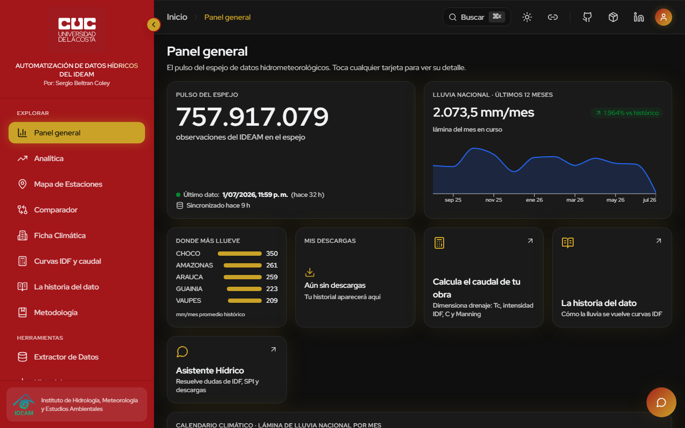 **Panel general** | 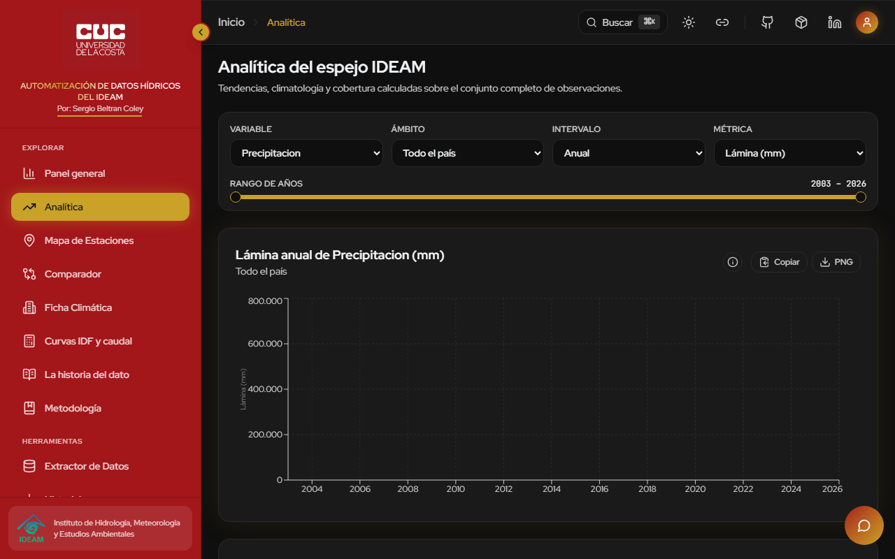 **Analítica** |
| 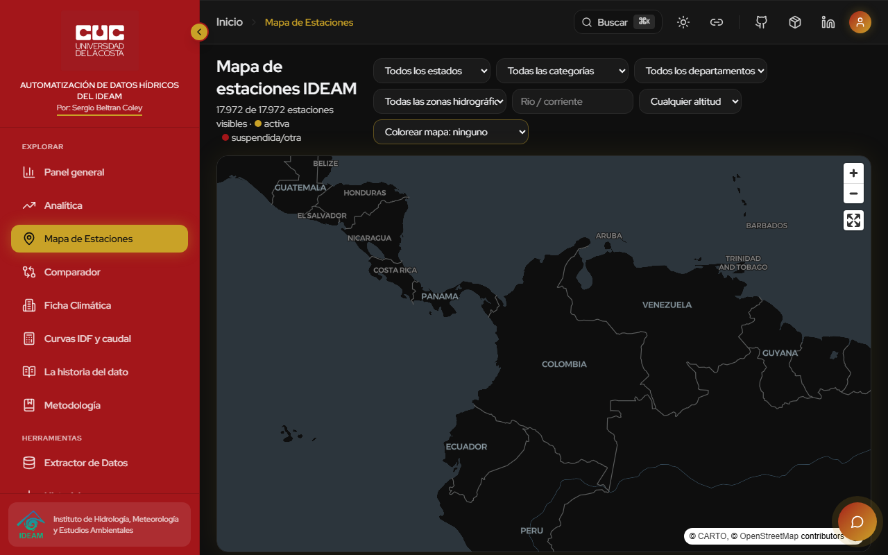 **Mapa de estaciones** | 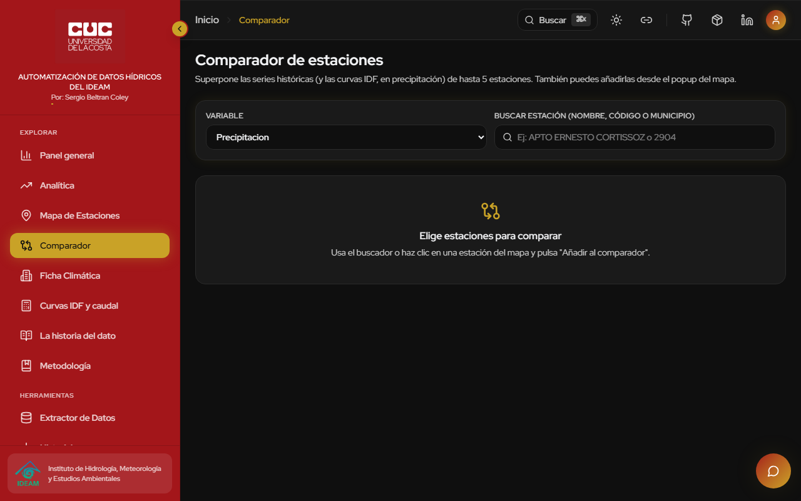 **Comparador** |
| 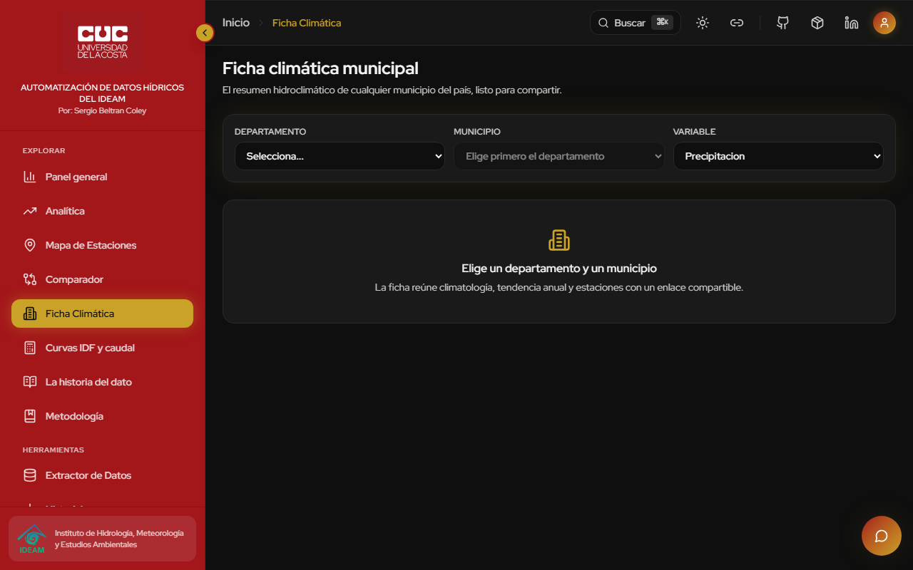 **Ficha climática** | 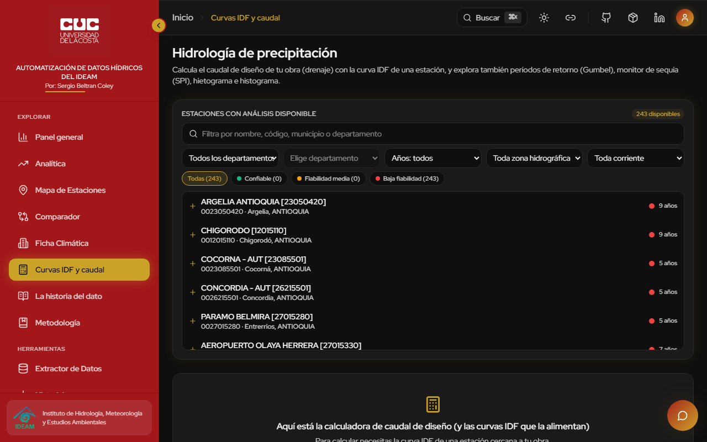 **Curvas IDF y caudal** |
| 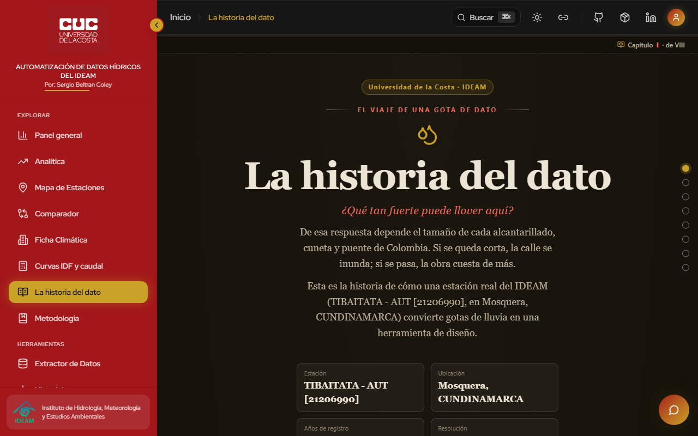 **La historia del dato** | 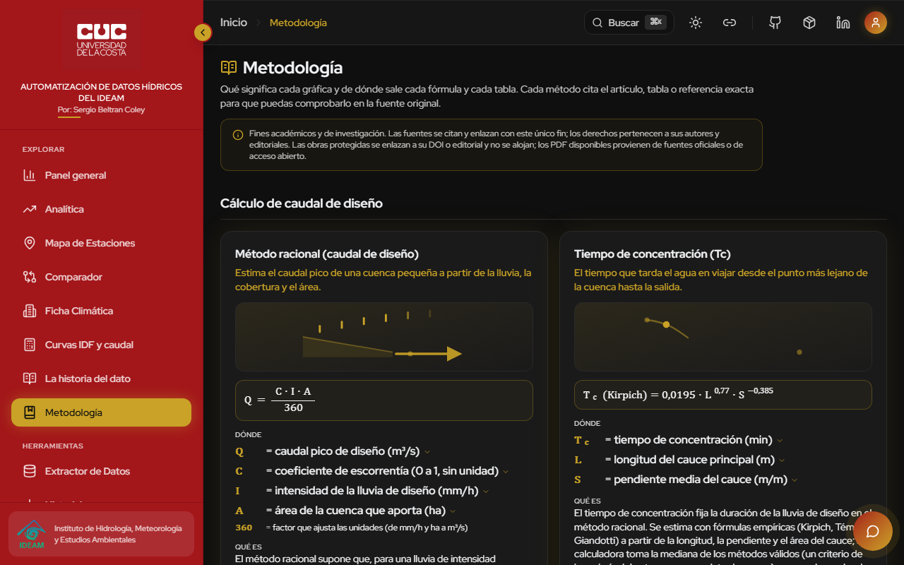 **Metodología** |
| 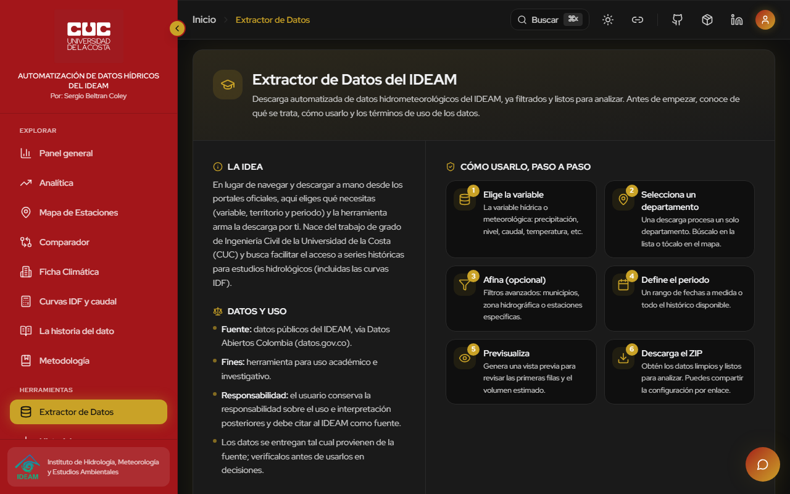 **Extractor de datos** | 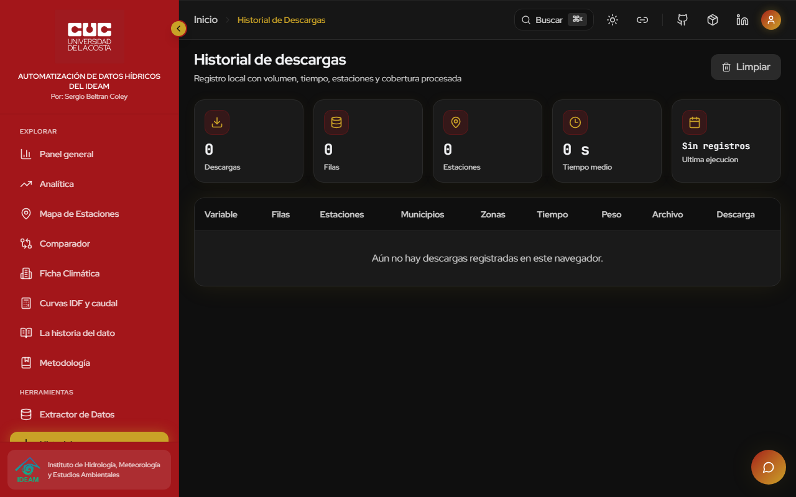 **Historial de descargas** |
| 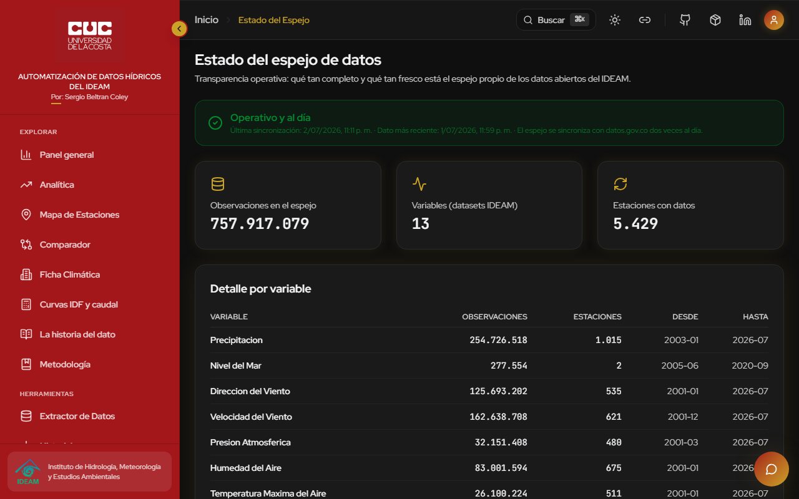 **Estado del espejo** | |

## Superficies

- `ideam.sergiobc.com`: la plataforma IDEAM (este README).
- `sergiobc.com` y `www.sergiobc.com`: sitio personal (carpeta `sitio-personal/`, despliegue manual).

## Arquitectura (dos repositorios)

El proyecto completo vive repartido en dos repositorios que se comunican por HTTPS:

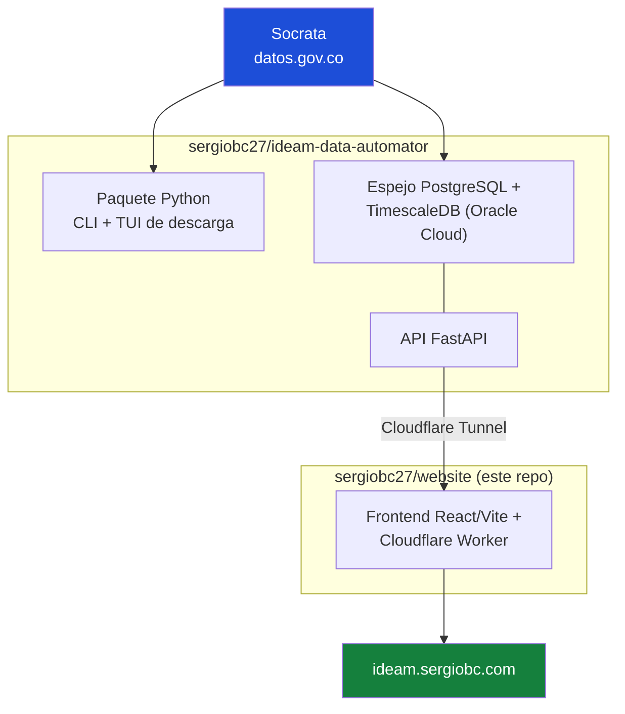

- **Este repo (`sergiobc27/website`)**: frontend React/Vite/TypeScript y el
  Cloudflare Worker (`src/worker/`) que sirve los assets, actúa como proxy
  autenticado de `/api/*` hacia la API propia, y maneja en el edge el asistente
  IA (Workers AI), el envío del PDF de curvas IDF por correo (Resend +
  Turnstile) y los PDFs de fuentes (R2). Un push a `main` despliega el Worker
  `ideam` en `ideam.sergiobc.com`.
- **[`sergiobc27/ideam-data-automator`](https://github.com/sergiobc27/ideam-data-automator)**:
  paquete Python instalable (CLI y TUI para descargar datos del IDEAM), el
  ingestor del espejo de datos y la API FastAPI sobre PostgreSQL/TimescaleDB,
  corriendo en un servidor Oracle y expuesta únicamente vía Cloudflare Tunnel
  como `ideam-api.sergiobc.com`.

Flujo de una consulta de la web:

1. Navegador -> Worker (edge): valida rutas públicas, inyecta el secreto del proxy y cachea catálogos.
2. Worker -> API FastAPI (box Oracle, vía Cloudflare Tunnel).
3. API -> TimescaleDB: espejo local de las observaciones del IDEAM (fuente original: Socrata, `www.datos.gov.co`).

Componentes de este repo:

- Frontend: React, Vite, TypeScript progresivo.
- Worker: proxy `/api/*`, asistente IA en el edge, correo IDF y fuentes en R2.
- Almacenamiento: R2 (PDFs de referencias), KV (rate limiting).

## Estructura

- `src/app/*`: interfaz React.
- `src/app/lib/ideamApi.ts`: cliente API del frontend.
- `src/app/lib/metodologia/`: registro de fórmulas, referencias y contenido normativo.
- `src/shared/ideamContracts.ts`: contratos TypeScript compartidos para respuestas API.
- `src/worker/index.js`: Worker, proxy `/api/*` a la API propia, asistente IA, correo IDF y fuentes R2.
- `tests/worker.test.mjs`: pruebas del Worker.
- `tests/e2e/ideam-production.spec.ts`: smoke test productivo.
- `.github/workflows/deploy-ideam.yml`: CI/CD.
- `docs/ARCHITECTURE.md`: arquitectura técnica.
- `docs/OPERATIONS.md`: operación, despliegue y troubleshooting.
- `docs/infografias/`: infografía del flujo web e instructivo de la plataforma (PDF).

## Comandos

```bash
npm install
npm run check
npm run typecheck
npm test
npm run build
npm run e2e:prod
```

Validación Cloudflare sin desplegar:

```bash
npx wrangler deploy --dry-run
```

## Variables y secrets

GitHub Actions requiere:

- `CLOUDFLARE_API_TOKEN`
- `CLOUDFLARE_ACCOUNT_ID`

Worker secret recomendado:

- `SOCRATA_APP_TOKEN`

Ejemplo local:

```bash
cp .env.example .env
npx wrangler secret put SOCRATA_APP_TOKEN
```

## Controles de costo

- No se permiten exportaciones globales sin departamento.
- `/api/jobs` limita a 30 exportaciones por hora por IP.
- Los ZIP quedan bajo `exports/<jobId>/` en R2.
- R2 elimina objetos `exports/` de más de 1 hora.
- Los catálogos persistentes usan `catalog-cache/` y no se eliminan por la regla horaria.

## Estado actual

Verificado:

- metadata y catálogos responden JSON,
- filtros avanzados cargan desde R2,
- Socrata responde para los 13 datasets soportados,
- exportaciones reales generan ZIP,
- ZIP incluye CSV, JSON y Parquet,
- descargas repetidas funcionan durante la ventana de 1 hora,
- CI ejecuta syntax check, typecheck, tests (Worker + unit), audit de dependencias de producción, build, validación dry-run del Worker, deploy y smoke test productivo (no bloqueante).

## Política de datos

Los datos provienen del IDEAM bajo la Política de Datos Abiertos de Colombia y
son de uso académico e investigativo. No se almacenan datos personales de los
visitantes; el historial de descargas vive solo en el navegador de cada usuario.
